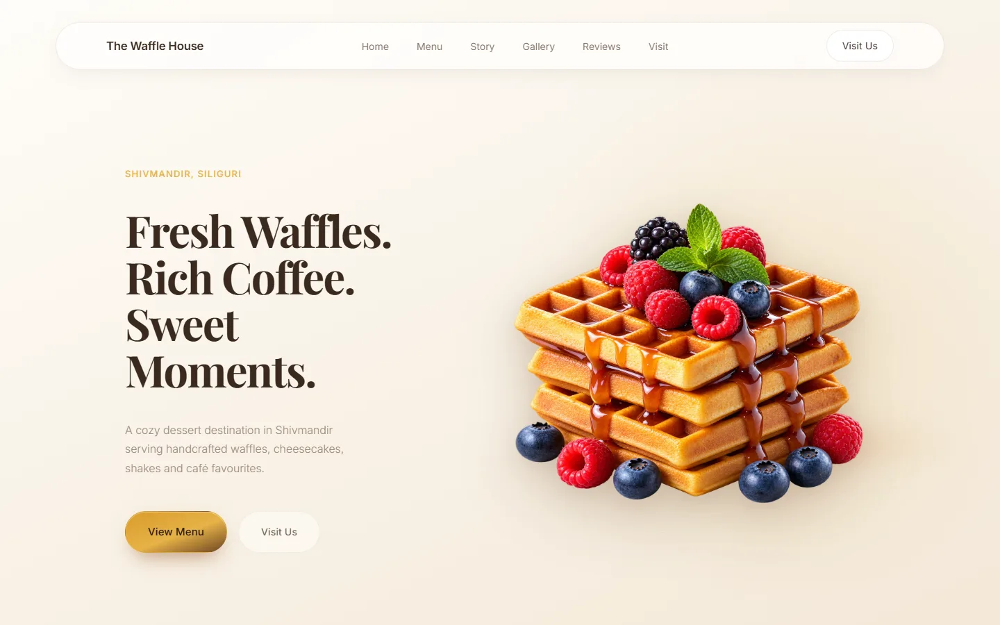
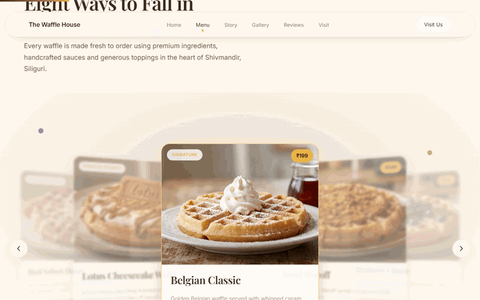
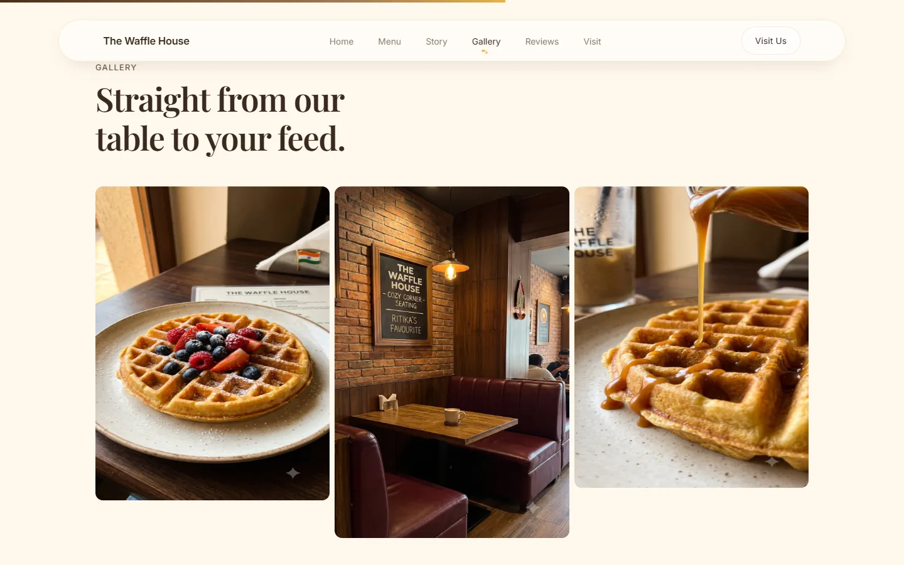
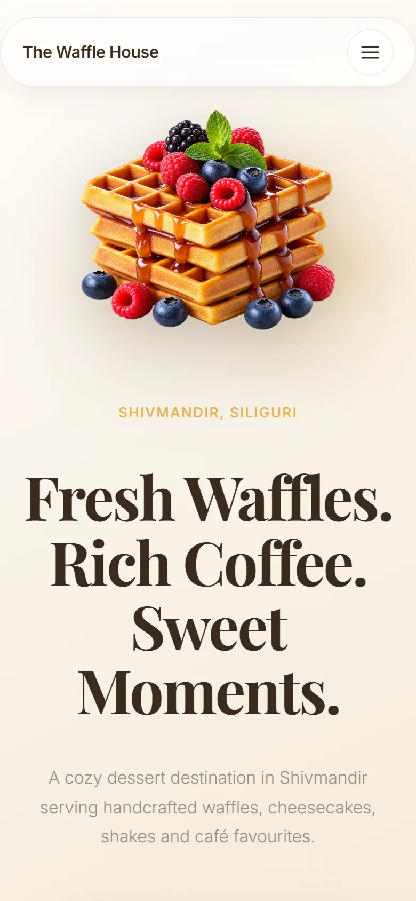
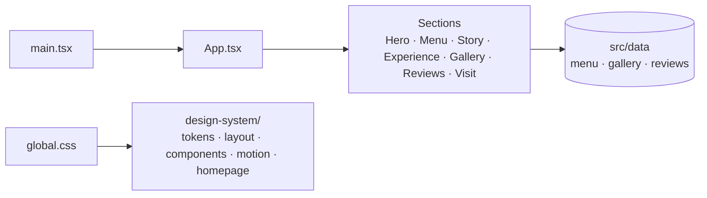
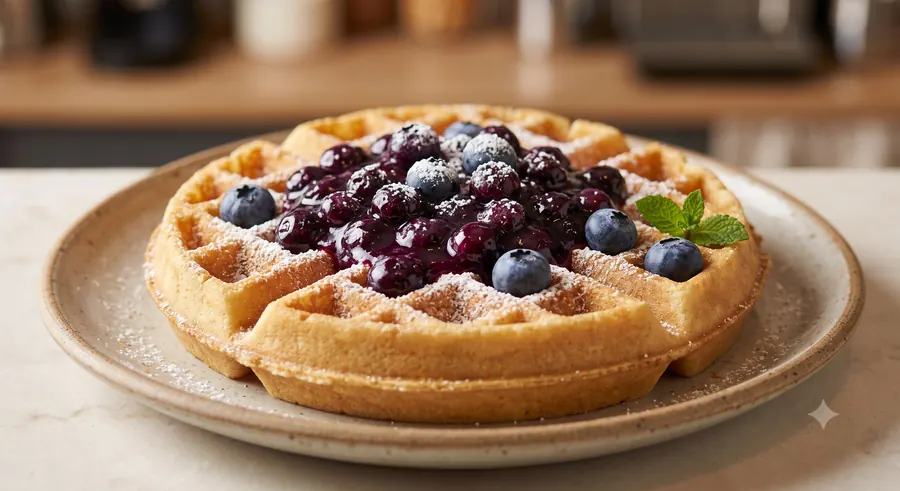
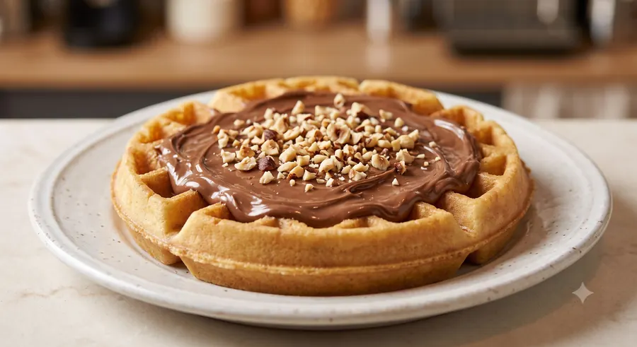
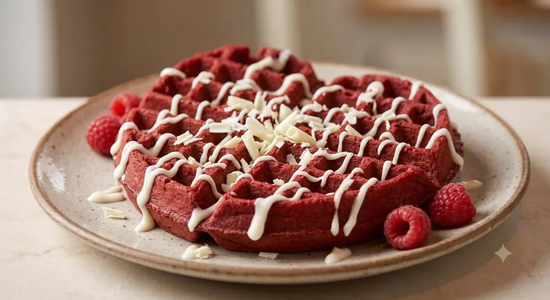
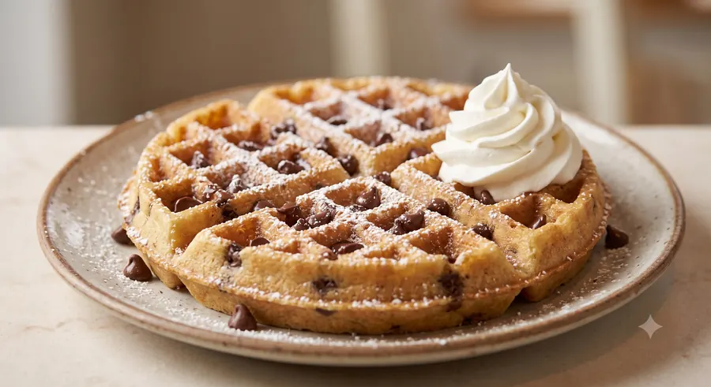
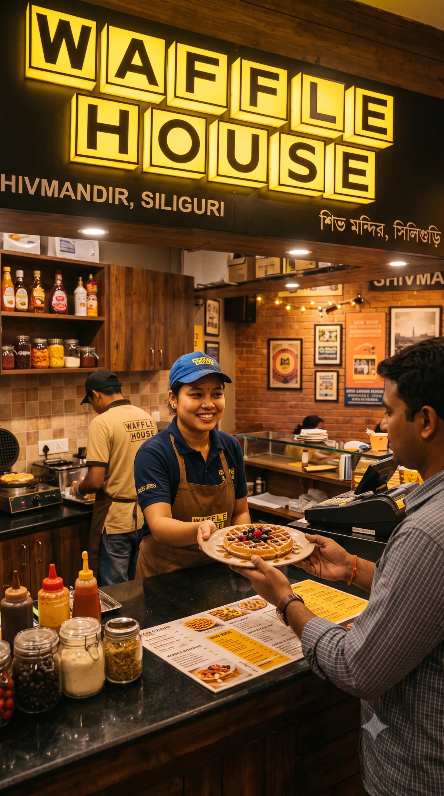

<div align="center">



<br />

    

<br />

**[Run it](#run-it)** &nbsp;·&nbsp; **[Features](#features)** &nbsp;·&nbsp; **[Architecture](#architecture)** &nbsp;·&nbsp; **[Installation](#installation)** &nbsp;·&nbsp; **[Gallery](#gallery)**

</div>

---

<p align="center">
  
</p>

The Waffle House is a one-page site for a Belgian waffle and dessert café in Shivmandir, Siliguri. It shows the signature menu with prices, the café's story, a photo gallery with a lightbox, customer reviews, and a visit section with an embedded map and the café's Instagram.

It began as plain HTML, CSS and JavaScript and was moved to React and Framer Motion. The original interaction layer is still in the repo as [`scripts/legacy-main.js`](scripts/legacy-main.js) for reference, but nothing loads it.

## Run it

No accounts, keys or environment variables.

```bash
git clone https://github.com/Samudra-GITHub/the-waffle-house.git
cd the-waffle-house && npm install && npm run dev
```

Then open the address Vite prints (by default <http://localhost:5173>).

## Features

<table>
  <tr>
    <td width="50%" valign="top">
      
      <h3>A hero that moves</h3>
      <p>A loading screen, a scroll-progress bar, a cursor glow, and a hero built around the waffle stack with a chocolate-fill effect.</p>
    </td>
    <td width="50%" valign="top">
      
      <h3>A menu you can browse</h3>
      <p>A carousel of the signature waffles and cheesecakes. Each card carries a tag and a price in rupees.</p>
    </td>
  </tr>
  <tr>
    <td width="50%" valign="top">
      
      <h3>Photos from the café</h3>
      <p>A gallery that opens in a lightbox, next to a story section, an experience section and customer reviews.</p>
    </td>
    <td width="50%" valign="top">
      
      <h3>Responsive from the start</h3>
      <p>The same page reflows for phones, with a compact navigation and the hero stacked above the headline.</p>
    </td>
  </tr>
</table>

**Also:** a visit section with an embedded map and directions link; decorative chocolate-drip, coffee-steam and floating-ingredient animations; SEO metadata (title, description, keywords, canonical link) in `index.html`.

## Tech stack

| Layer | Technology |
| :-- | :-- |
| UI | React 18, TypeScript 5 |
| Animation | Framer Motion 13 |
| Styling | Tailwind CSS 3, PostCSS, a custom CSS design system |
| Build | Vite 6 |

## Architecture



`App.tsx` stacks the sections in order. Content (menu items, gallery images, reviews) lives in `src/data/`. `src/styles/global.css` imports the five files in `design-system/`, which stay the single source of truth for tokens, layout and motion.

```text
the-waffle-house/
├── index.html            Entry HTML and SEO metadata
├── design-system/        CSS tokens, layout, components, motion, homepage styles
├── public/assets/        Optimised hero, menu, gallery, story and avatar images
├── scripts/              legacy-main.js, the archived vanilla-JS layer (not loaded)
├── src/
│   ├── components/       Navbar, Footer, Lightbox, Reveal, animations/
│   ├── sections/         Hero, MenuCarousel, Story, Experience, Gallery, Reviews, Visit
│   ├── data/             Menu, gallery and review content
│   └── styles/           global.css
└── docs/screenshots/     README captures
```

## Installation

Requires Node.js and npm.

```bash
npm install
```

| Command | What it does |
| :-- | :-- |
| `npm run dev` | Start the Vite dev server |
| `npm run build` | Type-check with `tsc -b`, then build to `dist/` |
| `npm run preview` | Preview the production build locally |

Menu, gallery and review content is in `src/data/`. Design tokens are in `design-system/tokens.css`.

## Gallery

<table>
  <tr>
    <td align="center"><br /><sub>Belgian Classic</sub></td>
    <td align="center"><br /><sub>Royal Biscoff</sub></td>
    <td align="center"><br /><sub>Blueberry Classic</sub></td>
    <td align="center"><br /><sub>Naked Nutella</sub></td>
  </tr>
  <tr>
    <td align="center"><br /><sub>Red Velvet Heart</sub></td>
    <td align="center"><br /><sub>Milk Chocolate Overload</sub></td>
    <td align="center"><br /><sub>Chocolate Chip Waffle</sub></td>
    <td align="center"><br /><sub>The counter</sub></td>
  </tr>
</table>

## Limitations

- No automated tests or CI workflow yet.
- No public deployment is listed.

## License

No license file is currently included in this repository.
